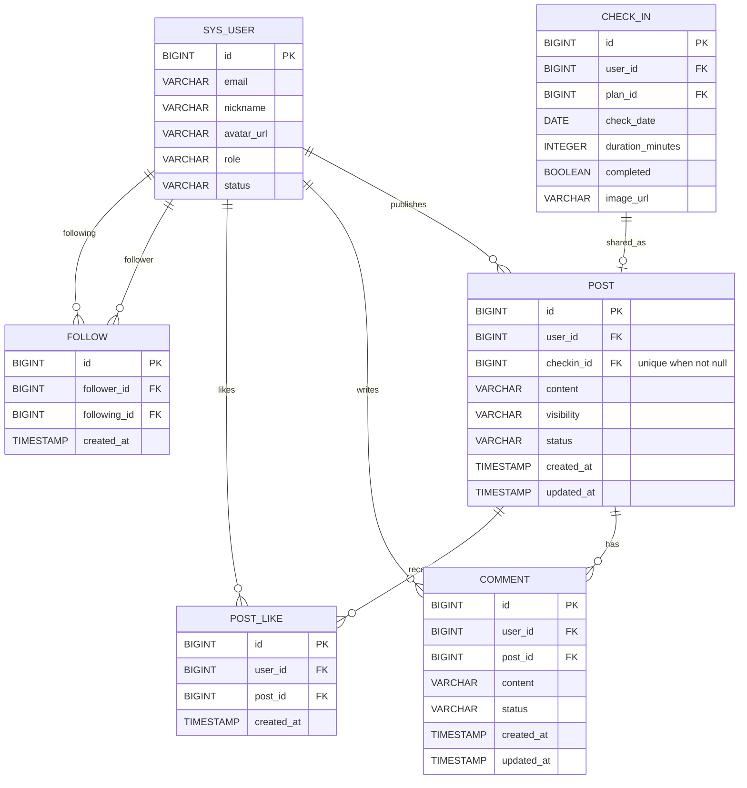

# StudyFlow 社区模块 ER 图

负责人：成泽楷  
版本：v1.0

```mermaid
erDiagram
    SYS_USER ||--o{ POST : publishes
    SYS_USER ||--o{ COMMENT : writes
    SYS_USER ||--o{ POST_LIKE : likes
    SYS_USER ||--o{ FOLLOW : follower
    SYS_USER ||--o{ FOLLOW : following
    CHECK_IN ||--o| POST : shared_as
    POST ||--o{ COMMENT : has
    POST ||--o{ POST_LIKE : receives

    SYS_USER {
        BIGINT id PK
        VARCHAR email
        VARCHAR nickname
        VARCHAR avatar_url
        VARCHAR role
        VARCHAR status
    }

    CHECK_IN {
        BIGINT id PK
        BIGINT user_id FK
        BIGINT plan_id FK
        DATE check_date
        INTEGER duration_minutes
        BOOLEAN completed
        VARCHAR image_url
    }

    POST {
        BIGINT id PK
        BIGINT user_id FK
        BIGINT checkin_id FK "unique when not null"
        VARCHAR content
        VARCHAR visibility
        VARCHAR status
        TIMESTAMP created_at
        TIMESTAMP updated_at
    }

    COMMENT {
        BIGINT id PK
        BIGINT user_id FK
        BIGINT post_id FK
        VARCHAR content
        VARCHAR status
        TIMESTAMP created_at
        TIMESTAMP updated_at
    }

    FOLLOW {
        BIGINT id PK
        BIGINT follower_id FK
        BIGINT following_id FK
        TIMESTAMP created_at
    }

    POST_LIKE {
        BIGINT id PK
        BIGINT user_id FK
        BIGINT post_id FK
        TIMESTAMP created_at
    }
```

关系说明：

- 一条已完成打卡在 P0 中最多发布一条动态。
- 一条动态可以有多条评论和多个点赞。
- 关注是用户到用户的自关联关系，不能关注自己。
- 动态、评论均采用软删除，保留原始审计线索。
